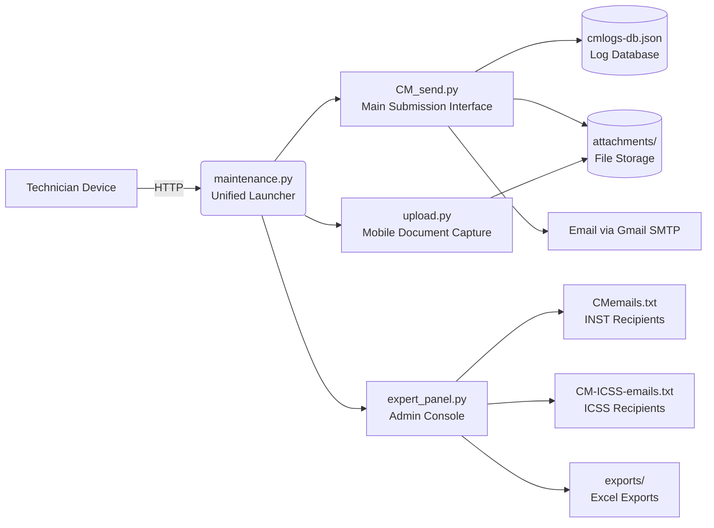

# 🛠️ Corrective Maintenance (CM) Log System  
*Local-First Maintenance Reporting for NGUYA FLNG Facility*  


A secure, mobile-optimized web application for logging equipment issues with departmental routing (INST/ICSS), email notifications, and Excel exports. Built with Gradio for zero-install deployment on local networks.

---

## 🌟 Key Features
| Feature | Description |
|---------|-------------|
| **Dual Routing** | One-click submission to INST (Instrumentation) or ICSS (Control Systems) teams |
| **Mobile Capture** | Direct camera access on Android/iOS for photo documentation |
| **Sequential IDs** | Auto-generated CM-XXXXX tracking IDs with JSON database persistence |
| **Email Alerts** | Gmail SMTP notifications with original filenames preserved |
| **Admin Console** | Manage recipients + export logs to formatted Excel (auto-sized columns) |
| **Local-First** | 100% on-premise storage – no cloud dependencies or external APIs |
| **Responsive UI** | Optimized for desktops, tablets, and mobile devices |

---

## 🏗️ System Architecture


### Component Breakdown
| File | Port | Purpose | Access Level |
|------|------|---------|--------------|
| `maintenance.py` | 7960 | **Unified launcher** (routes all interfaces) | All users |
| `CM_send.py` | 7960 | Main CM submission form + log table | All personnel |
| `upload.py` | 7960 | Mobile-optimized file/camera capture | All personnel |
| `expert_panel.py` | 7961 | Recipient management + Excel exports | Admin only |
| `cmlogs-db.json` | - | Persistent log database (JSON) | Server storage |
| `attachments/` | - | Sanitized file storage directory | Server storage |

---

## 📦 Installation & Setup

### Prerequisites
```bash
Python 3.8+ 
pip install gradio pandas openpyxl
```

### Quick Start
```bash
# 1. Clone repository
git clone https://github.com/fabiomatricardi/cm-log-system.git
cd cm-log-system

# 2. Create required directories
mkdir -p attachments exports

# 3. Initialize configuration files
touch cmlogs-db.json CMemails.txt CM-ICSS-emails.txt secret.json
```

### 🔑 Critical Configuration
1. **`secret.json`** (Gmail App Password required):
   ```json
   {"secret_code": "your_gmail_app_password_here"}
   ```
   > 💡 [Generate App Password](https://myaccount.google.com/apppasswords) (Enable 2FA first)

2. **Recipient Lists** (`CMemails.txt` / `CM-ICSS-emails.txt`):
   ```txt
   # INST Team Recipients (CMemails.txt)
   technician1@nguya-flng.com
   lead.inst@nguya-flng.com
   
   # ICSS Team Recipients (CM-ICSS-emails.txt)
   icss.support@nguya-flng.com
   control.room@nguya-flng.com
   ```
   *Lines starting with `#` are comments*

3. **(Optional) Change default admin password** in `expert_panel.py`:
   ```python
   # Line ~105: Update hardcoded credentials
   if username.strip() == "your_secure_user" and password.strip() == "your_secure_pass":
   ```

---

## 🚀 Running the Application
```bash
# Launch unified interface (recommended)
python maintenance.py

# Access points:
# • Main App: http://<SERVER_IP>:7960
# • Admin Panel: http://<SERVER_IP>:7961 OR via tab in main app
```

### Network Deployment Checklist
- [ ] Open ports `7960` and `7961` on server firewall
- [ ] Replace `<SERVER_IP>` with facility LAN IP (e.g., `192.168.10.45`)
- [ ] Verify `attachments/` and `exports/` have write permissions
- [ ] Test email functionality with recipient files populated
- [ ] **CRITICAL**: Change default admin credentials before deployment

---

## 📱 Interface Guide
### Main Submission Workflow (`CM_send.py`)
1. Attach files via upload or mobile camera capture
2. Fill required fields: **TAGNAME** + **REPORTED BY**
3. Click routing button:
   - 🧰 **SAVE & SEND to INST** → Instrumentation team
   - 🎛️ **SAVE & SEND to ICSS** → Control systems team
4. Receive confirmation with CM-XXXXX ID
5. View recent logs in live-updating table (last 20 entries)

### Mobile Capture (`upload.py`)
- Access via **"📲 Mobile Upload photo/documents"** tab
- Tap upload area → Select **"Camera"** → Capture → Save
- Files instantly available in main submission form
- *Tip: Chrome on Android → Site Settings → Allow camera for server IP*

### Admin Console (`expert_panel.py`)
- Login: `admin` / `admin` (change before production!)
- Edit recipient lists with live validation
- Export full database to Excel with timestamped filename
- View file paths and system status

---

## 🔒 Security & Compliance
| Aspect | Implementation |
|--------|----------------|
| **Data Sovereignty** | All logs/files stored locally – zero cloud transmission |
| **File Safety** | Filename sanitization prevents path traversal attacks |
| **Network Security** | HTTP-only (designed for isolated LAN deployment) |
| **Email Security** | Gmail App Passwords (not account passwords) required |
| **Access Control** | Admin panel protected by hardcoded credentials |
| **Audit Trail** | Sequential IDs + timestamps in all logs |

> ⚠️ **Critical Deployment Notes**  
> - **NEVER expose ports 7960/7961 to public internet**  
> - Change default admin credentials immediately  
> - Regularly backup `cmlogs-db.json` and `attachments/`  
> - Camera access requires HTTPS for reliable mobile use (see Troubleshooting)  

---

## 🛠️ Troubleshooting
| Issue | Solution |
|-------|----------|
| ❌ *"Email auth failed"* | Verify `secret.json` contains valid Gmail App Password (not account password) |
| 📱 Camera blocked on mobile | Use Chrome → Site Settings → Allow camera for server IP; or use file upload |
| ⚠️ *"No recipients found"* | Ensure recipient files contain non-comment emails (lines without `#`) |
| 📁 File save errors | Confirm `attachments/` directory has write permissions |
| 🌐 Can't access from network | Check server firewall allows ports 7960/7961; verify LAN IP address |
| 📊 Excel export fails | Install dependencies: `pip install pandas openpyxl` |

> 💡 **Pro Tip**: Reports save locally even if email fails. Check `cmlogs-db.json` for confirmation.

---

## 📜 License & Support
**Proprietary Software**  
© 2026 Key Solution SRL – Developed exclusively for NGUYA FLNG Project  
*Unauthorized distribution, modification, or use prohibited*

### Support Contact
📧 **Technical Support**: fabio.matricardi@key-solution.eu  
🌐 **Company**: [Key Solution SRL](https://key-solution.eu)  
📍 **Project**: NGUYA FLNG Maintenance Systems (Congo)  

---

## 🙏 Acknowledgements
- Built with [Gradio](https://www.gradio.app/) for rapid UI development  
- Email functionality powered by Python `smtplib`  
- Excel exports via `pandas` + `openpyxl`  
- Designed for operational safety compliance at NGUYA FLNG facility  

---

> ℹ️ **System Status**: Production-ready for LAN deployment  
> 📅 Last Updated: February 11, 2026  
> 🔐 *All data remains within your facility network – no external dependencies beyond email notifications*  

```plaintext
📁 Project Structure
cm-log-system/
├── CM_send.py               # Main submission interface
├── upload.py                # Mobile document capture
├── expert_panel.py          # Admin console
├── maintenance.py           # Unified launcher (routes all interfaces)
├── cmlogs-db.json           # Log database (auto-created)
├── secret.json              # Gmail App Password (CREATE MANUALLY)
├── CMemails.txt             # INST team recipients (CREATE MANUALLY)
├── CM-ICSS-emails.txt       # ICSS team recipients (CREATE MANUALLY)
├── attachments/             # Uploaded files storage
├── exports/                 # Excel exports directory
└── logo.png                 # UI branding asset
```


---


